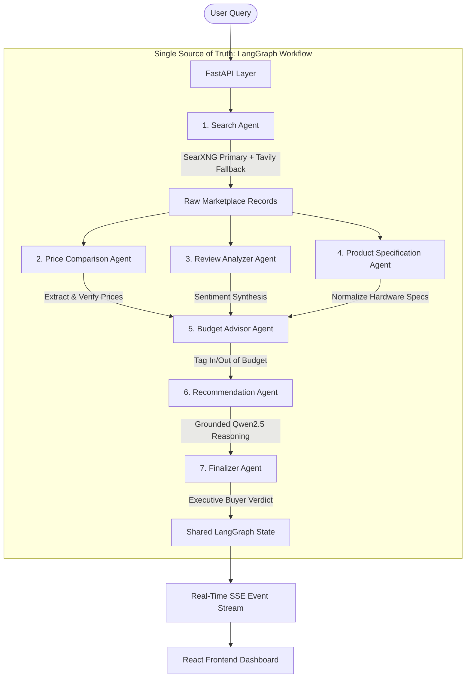

# 🛍️ SEAMAS: Smart E-Commerce Multi-Agent System

**SEAMAS (Smart E-Commerce Multi-Agent System)** is a production-grade, AI-powered multi-agent e-commerce shopping assistant. It coordinates 7 autonomous specialists orchestrated via **LangGraph as the Single Source of Truth**, querying live Indian and global marketplaces, comparing authentic prices, normalizing technical specifications, evaluating budget constraints, synthesizing customer reviews, and streaming real-time execution events directly to a modern React frontend.

---

## 🏗️ System Architecture

LangGraph governs the entire execution flow for both synchronous API requests (`/api/chat`) and real-time Server-Sent Events (`/api/chat/stream`).



### The 7 Autonomous Agents
1. 🔍 **Search Agent (`search`)**: High-yield e-commerce retrieval using SearXNG as primary engine (Render or local) with seamless Tavily API fallback.
2. 🏷️ **Price Comparison Agent (`price`)**: Extracts authentic current sale prices, crossed-out MRPs, filters out deceptive EMIs, eliminates duplicate listings, and preserves source URLs.
3. 💬 **Review Analyzer Agent (`reviews`)**: Extracts marketplace ratings (out of 5 stars) and review volume, distilling genuine pros and cons via Qwen2.5 with deterministic fallback.
4. ⚙️ **Product Specification Agent (`specs`)**: Category-aware hardware and product attribute normalizer (Display, Processor, RAM, Storage, Camera, Battery, OS, Connectivity).
5. 💰 **Budget Advisor Agent (`budget`)**: Deterministically parses hard ceilings ("under ₹30,000") vs flexible targets ("around 25k") and classifies listings as *Target Match*, *Stretch Match*, or *Out of Budget*.
6. 💡 **Recommendation Agent (`recommendation`)**: Formulates strategic buyer recommendations grounded strictly in verified candidate listings.
7. 🛡️ **Finalizer Agent (`finalizer`)**: Compiles structured Markdown reports and synthesizes executive purchase verdicts with return/warranty confidence.

---

## ⚡ Key Technical Capabilities

- **LangGraph Single Source of Truth**: Unified workflow definition; streaming execution observes real LangGraph node transitions (`node_start`, `node_complete`, `node_error`, `result`) without duplicate pipeline implementations.
- **Resilient Search Pipeline**: Render SearXNG with configurable timeout (22s) and automatic fallback to Tavily when unavailable.
- **Local LLM with Deterministic Fallbacks**: Leverages `qwen2.5` via Ollama (`OLLAMA_MODEL` configurable, e.g. `qwen2.5:0.5b`), with immediate rule-based fallbacks ensuring zero crashes when Ollama is offline.
- **Grounded AI Reasoning**: The LLM evaluates only extracted candidate records; no fabricated prices, models, or hallucinated specifications.
- **Strict Verification & Anti-Deception**: Filters out EMI amounts, accessory listings (cases, covers) when searching for flagship phones, and validates seller reputation.

---

## ⚙️ Environment Variables

Create a `backend/.env` file with the following configuration:

```ini
# Search Engines
SEARXNG_BASE_URL=https://seamas-searxng.onrender.com
SEARXNG_TIMEOUT=22.0
TAVILY_API_KEY=tvly-your-api-key-here
MAX_SEARCH_PAGES=2

# Ollama / Qwen2.5
OLLAMA_HOST=http://localhost:11434
OLLAMA_MODEL=qwen2.5:0.5b

# Workflow Orchestration
AGENT_MODE=graph

# Supabase (Optional for user auth, history & caching)
SUPABASE_URL=https://your-project.supabase.co
SUPABASE_ANON_KEY=your-anon-key
SUPABASE_SERVICE_ROLE_KEY=your-service-role-key

# Razorpay (Test / Sandbox)
RAZORPAY_KEY_ID=rzp_test_your_key_id
RAZORPAY_KEY_SECRET=your_secret_key
```

---

## 🚀 Quickstart Guide

### 1. Backend Startup

```powershell
cd backend
# Install Python dependencies
pip install -r requirements.txt

# Start FastAPI server
python -m uvicorn app.main:app --host 127.0.0.1 --port 8000 --reload
```

The API docs are available at `http://127.0.0.1:8000/docs`.

### 2. Frontend Startup

```powershell
cd frontend
# Install Node dependencies
npm install

# Start Vite development server
npm run dev
```

Open `http://localhost:5173` in your browser.

---

## 🧪 Testing & Verification

Run the automated test suite covering unit tests, LangGraph integration, failure fallbacks, and realistic query benchmarks:

```powershell
# Run from repository root
$env:PYTHONPATH="backend"
python -m pytest backend/tests -v
```

### Test Coverage Summary:
- **`test_agents.py`**: Unit tests for Search, Price, Review, Specification, Budget, Recommendation, and Finalizer agents.
- **`test_graph_integration.py`**: Complete LangGraph execution, state propagation, and parallel agent execution.
- **`test_failures_and_fallbacks.py`**: SearXNG timeout, Tavily fallback, Ollama offline, malformed search records, empty results, price cleaning, and EMI rejection.
- **`test_queries.py`**: Realistic query evaluation (smartphones, laptops, gaming rigs, budget ranges).

---

## 📊 Endpoints Overview

| Method | Route | Description |
|---|---|---|
| `POST` | `/api/chat` | Executes the LangGraph multi-agent workflow synchronously |
| `POST` | `/api/chat/stream` | Streams real-time Server-Sent Events (`node_start`, `node_complete`, `result`) directly from LangGraph |
| `GET` | `/api/status` | Health check for API, Supabase, and Ollama agents |
| `GET` | `/api/credits/me` | Retrieves the authenticated user's balance and subscription tier |
| `POST` | `/api/create-order` | Creates a server-priced payment transaction and Razorpay payment link |
| `POST` | `/api/verify-payment` | Verifies the authenticated user's server-owned payment transaction |
# Production hardening notes

## Environment setup

Copy `backend/.env.example` to `backend/.env` and `frontend/.env.example` to
`frontend/.env.local`. Frontend `VITE_*` settings are public bundle values; never
put service role, payment secret, or provider API keys in frontend configuration.
For production set `ENVIRONMENT=production`, explicit HTTPS `FRONTEND_BASE_URL`,
`BACKEND_BASE_URL`, and comma-separated HTTPS origin-only `ALLOWED_ORIGINS`; startup
rejects local/placeholder URLs, missing Supabase or Razorpay configuration, test
Razorpay keys, wildcard origins, and missing distributed rate-limit settings.
Configure `UPSTASH_REDIS_REST_URL`, `UPSTASH_REDIS_REST_TOKEN`, and a random
`RATE_LIMIT_KEY_SECRET` (at least 32 characters) in the backend secret store.
`backend/.env.production.example` is a checklist only; its example values must be
replaced before deployment.

## Supabase production migration

Apply `supabase_production_migration.sql` first to a disposable Supabase test
project, verify two-user RLS and account deletion, then apply it to the intended
production project through the normal migration process. It prepares profile,
search-history, cache, credit, and payment tables; restricts private data access;
adds signup/deletion triggers and RPCs; and creates `seamas_schema_is_ready()`.
`/ready` checks that capability RPC and stays 503 until the required schema is
present. Keep `SUPABASE_SERVICE_ROLE_KEY` only in the backend secret store.

## Shared rate limits

Production request limits use an atomic Redis sliding window shared across backend
instances through Upstash REST. Authentication verification is limited by client
IP, and chat, payment, credit, and general authenticated API calls have per-user
limits. The backend fails closed with 503 if Redis protection is unavailable.

## Authentication and payments

Chat, credit lookup, order creation, and payment verification require a Supabase
access token in the `Authorization: Bearer ...` header. Credit identity comes from
the verified token. Payment verification looks up the server-created transaction,
validates Razorpay signatures and the fetched captured payment/link amount, then
credits through the idempotent database RPC. Pricing in plan configuration and
payment transaction `amount` values use Razorpay minor units (paise for INR).

## Price and availability policy

Search snippets are candidate discovery only. The backend reports a price as
verified only after extracting it from the original HTTPS product page; failed or
blocked checks return an unavailable price. Exact stock quantity remains null
unless a source explicitly provides one. Product-page checks are time-limited,
bounded by `MAX_PRODUCTS_TO_VERIFY` and `PRICE_VERIFICATION_CONCURRENCY`, reject
private/local destinations, and do not follow redirects.

Compare captured UI and source-page JSON arrays without hard-coded products using
`python backend/tools/price_discrepancy.py ui.json source.json`. Its CSV output
includes UI/source prices, their difference, source URL, and verification time;
records only match when their source URLs match.

## Health and deployment

`GET /health` checks process liveness; `GET /ready` checks Supabase availability.
Deploy FastAPI behind a TLS-terminating proxy with a production ASGI server, and
serve the Vite `npm run build` output from a static host or web server. Apply the
SQL migration and configure external credentials and URLs before deployment.
